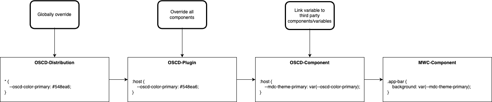

# Design proposal for Open-SCD

Date: 2023-05-16

## Status

Open

## Context
If we want a themable application where plugin authors can rely on a global style, we should make use of css variables. We can also make use of [Design Tokens](https://spectrum.adobe.com/page/design-tokens/).
With design tokens, we can generate css variables.

We can then override the Material css variables, so all the material components (mdc/mwc) will have the same look.

### Background
Related links:
- [Adobe Design tokens](https://spectrum.adobe.com/page/design-tokens/)
- [Design Tokens for dummies](https://uxdesign.cc/design-tokens-for-dummies-8acebf010d71)
- [Material Design Tokens](https://m3.material.io/foundations/design-tokens)

### Naming
We should come to a global agreement of naming variables.
My suggestion would be to follow the following standard:

<pre>--{namespace}-[{tier}]-[{prefix}]-{name}-[{suffix}]-[{scale}]</pre>

Implementation of this standard:

#### Example 1
<pre>--oscd-color-primary: #548ea6;</pre>

Namespace: <pre>--<b>oscd</b>-color-primary</pre>
Tier: - 
prefix: - 
name: <pre>--oscd-<b>color</b>-primary</pre>
suffix: <pre>--oscd-color-<b>primary</b></pre>
scale: - 

#### Example 2
<pre>--oscd-dark-color-primary-100: #548ea6;</pre>

Namespace: <pre>--<b>oscd</b>-dark-color-primary-100</pre>
Tier: <pre>--oscd-<b>dark</b>-color-primary-100</pre>
prefix: - 
name: <pre>--oscd-dark-<b>color</b>-primary-100</pre>
suffix: <pre>--oscd-dark-color-<b>primary</b>-100</pre>
scale: <pre>--oscd-dark-color-primary-<b>100</b></pre>

## Decision

T.B.D.

## Consequences
This decision will mean that the current OSCD components will need some extra 
css styling to link OSCD css variables to internal styles (or mwc-variables).
