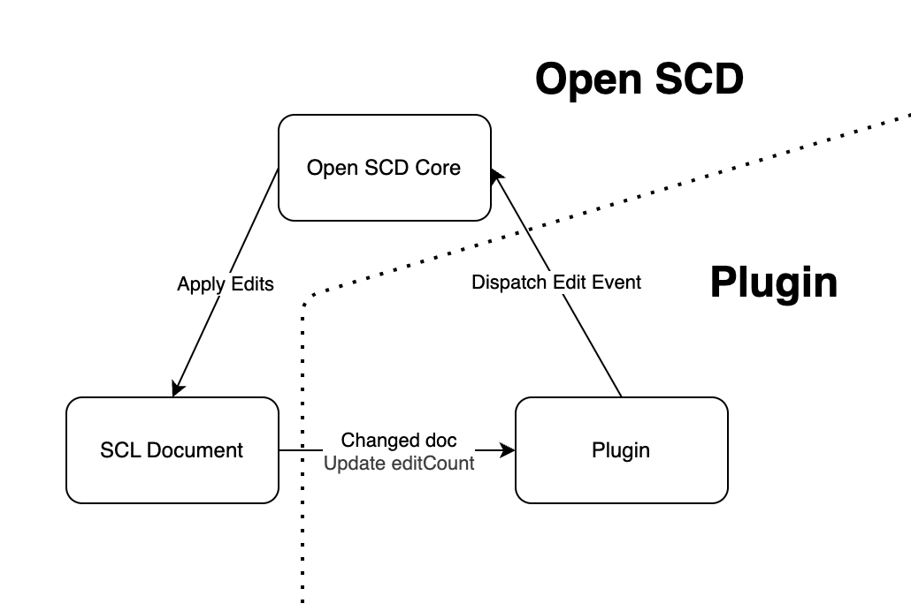

# Edit Event API v2

Open SCD offers an API for editing the scd document which can be used with [Html Custom Events](https://developer.mozilla.org/en-US/docs/Web/API/CustomEvent/CustomEvent). The main Open SCD components listens to events of the type `oscd-edit-v2`, applies the changes to the `doc` and updates the `editCount` property.



The edits to the `doc` will be done in place, e.g. the `doc` changes but will keep the same reference. If your plugin needs to react to changes in the doc, you should listen to changes in the `editCount` property.

## Event factory

Open SCD core exports a factory function for edit events, so you do not have to build them manually.

```ts
function newEditEventV2<E extends EditV2>(
  edit: E,
  options?: EditEventOptionsV2
): EditEventV2

type EditV2 = InsertV2 | SetAttributesV2 | SetTextContentV2 | RemoveV2 | EditV2[];

interface EditEventOptionsV2 = {
  title?: string;
  squash?: boolean;
  createHistoryEntry?: boolean;
};
```

### EditEventOptionsV2

* `title` set a title to be shown in the history.
* `squash` squash edit with previous history entry, this is useful if you want to create multiple edits based on an user action, but need the updated `doc` before applying each edit. Defaults to `false`.
* `createHistoryEntry` decides whether a history for the `edit` should be created. Defaults to `true`.

### Insert

Insert events can be used to add new nodes or move existing nodes in the document. Since a node can only have one parent, using an insert on an existing node will replace it's previous parent with the new parent, essentially moving the node to a different position in the xml tree.

If the reference is not `null`, the node will be inserted before the reference node. The reference has to be a child node of the parent. And if the reference is `null` the node will be added as the last child of the parent.

```ts
interface InsertV2 {
  parent: Node;
  node: Node;
  reference: Node | null;
}
```

### Remove

This event will remove the node from the document.

```ts
interface RemoveV2 {
  node: Node;
}
```

### SetAttributes

Sets attributes for the element, can set both regular and namespaced attributes.

```ts
interface SetAttributesV2 {
  element: Element;
  attributes: Partial<Record<string, string | null>>;
  attributesNS: Partial<Record<string, Partial<Record<string, string | null>>>>;
}
```

To set a namespaced attribute see the following example. Here we are setting the attribute `exa:type` for the namespace `https://example.com` to `secondary`.

```ts
const setNamespacedAttributes: SetAttributesV2 = {
  element,
  attributes: {},
  attributesNS: {
    "https://example.com": {
      "exa:type": "secondary"
    }
  }
}
```

### SetTextContent

Sets the text content of the element, removes any other children. To remove text content you can pass `null` as value for `textContent`.

```ts
interface SetTextContentV2 {
  element: Element;
  textContent: string;
}
```

### Complex edits

Complex edits can be used to apply multiple edits as a single event. This will create a single entry in the history. You can create complex edit events by passing an array of edit events to the `newEditEventV2` factory function.

```ts
import { newEditEventV2 } from '@openscd/core';

const complexEditEvent = newEditEventV2([ insert, update, remove ]);

someComponent.dispatchEvent(complexEditEvent);

```

## History

All edit events with the option `createHistoryEntry` will create a history log entry and can be undone and redone through the history addon.


# Archives

## Edit Event API v1 (deprecated)

The edit event API v1 is still available and listens to events of the type `oscd-edit`.

## Event factory

Open SCD core exports a factory function for edit events, so you do not have to build them manually.

```ts
function newEditEvent<E extends Edit>(
  edit: E,
  initiator: Initiator = 'user'
): EditEvent

type Edit = Insert | Update | Remove | Edit[];

type Initiator = 'user' | 'system' | 'undo' | 'redo' | string;

```

Example for remove.

```ts
import { newEditEvent, Remove } from '@openscd/core';

const remove: Remove = { node: someNode };
const removeEvent = newEditEvent(remove);

someComponent.dispatchEvent(removeEvent);

```


### Insert

Insert events can be used to add new nodes or move existing nodes in the document. Since a node can only have one parent, using an insert on an existing node will replace it's previous parent with the new parent, essentially moving the node to a different position in the xml tree.

If the reference is not `null`, the node will be inserted before the reference node. The reference has to be a child node of the parent. And if the reference is `null` the node will be added as the last child of the parent.

```ts
interface Insert {
  parent: Node;
  node: Node;
  reference: Node | null;
}
```


### Remove

This event will remove the node from the document.

```ts
interface Remove {
  node: Node;
}
```


### Update

Update can add, remove or change attributes on an existing node. Existing attributes will only be removed, if `null` is passed as value in the event's `attributes` property.


```ts
interface Update {
  element: Element;
  attributes: Partial<Record<string, AttributeValue>>;
}

// Attirubte value

type AttributeValue = string | null | NamespacedAttributeValue;

type NamespacedAttributeValue = {
  value: string | null;
  namespaceURI: string | null;
};
```

Example for adding and changing values.

```ts

const update: Update = {
  element: elementToUpdate,
  attributes: {
    name: 'new name',
    value: 'new value'
  }
};

```

To remove an existing value pass `null` as value.

```ts

const update: Update = {
  element: elementToUpdate,
  attributes: {
    attributeToRemove: null
  }
};

```

Update also supports [Xml namespaces](https://developer.mozilla.org/en-US/docs/Related/IMSC/Namespaces#namespaced_attributes) for attributes. To change namespaced attributes you need to pass an `NamespacedAttributeValue` instead of a plain `string`.

```ts

const update: Update = {
  element: elementToUpdate,
  attributes: {
    name: {
      value: 'namespaced name',
      namespaceURI: 'http://www.iec.ch/61850/2003/SCLcoordinates'
    },
    type: {
      value: 'namespaced type',
      namespaceURI: 'http://www.iec.ch/61850/2003/SCLcoordinates'
    },
  }
};

```

Adding, updating and removing attributes with and without namespaces can be combined in a single `Update`.

### Complex edits

Complex edits can be used to apply multiple edits as a single event. This will create a single entry in the history. You can create complex edit events by passing an array of edit events to the `newEditEvent` factory function.

```ts
import { newEditEvent } from '@openscd/core';

const complexEditEvent = newEditEvent([ insert, update, remove ]);

someComponent.dispatchEvent(complexEditEvent);

```


## History

All edit events with initiator `user` will create a history log entry and can be undone and redone through the history addon.

## Breaking changes due to migration
Before the edit event API the editor action API was used to edit the `doc`. It is also custom event based and listens to the events of the type `editor-action`.
For backwards compatibility the API is still supported, but it is recommended to use the edit event API instead. Internally editor actions are converted to edit events.
With open SCD version **v0.36.0** and higher some editor action features are no longer supported see [Deprecated Editor Action API](#archives---editor-action-api-deprecated). 
* The editor action properties `derived` and `checkValidity` do not have any effect.
* All validation checks have been removed (i.e. check for unique `id` attribute on element before create).
* The `title` for `ComplexAction` does not have any effect.

---

## Editor Action API (deprecated)

### Event factory

```ts

function newActionEvent<T extends EditorAction>(
  action: T,
  initiator: Initiator = 'user',
  eventInitDict?: CustomEventInit<Partial<EditorActionDetail<T>>>
): EditorActionEvent<T>

type SimpleAction = Update | Create | Replace | Delete | Move;
type ComplexAction = {
  actions: SimpleAction[];
  title: string;
  derived?: boolean;
};
type EditorAction = SimpleAction | ComplexAction;

```


### Create

`Create` actions are converted to `Insert` events.

```ts
interface Create {
  new: { parent: Node; element: Node; reference?: Node | null };
  derived?: boolean;
  checkValidity?: () => boolean;
}
```

### Move

`Move` actions are converted to `Insert` events.

```ts
interface Move {
  old: { parent: Element; element: Element; reference?: Node | null };
  new: { parent: Element; reference?: Node | null };
  derived?: boolean;
  checkValidity?: () => boolean;
}
```


### Delete

`Delete` actions are converted to `Remove` events.

```ts
interface Delete {
  old: { parent: Node; element: Node; reference?: Node | null };
  derived?: boolean;
  checkValidity?: () => boolean;
}
```


### Update

`Update` actions are converted to `Update` events.

```ts
interface Update {
  element: Element;
  oldAttributes: Record<string, string | null>;
  newAttributes: Record<string, string | null>;
  derived?: boolean;
  checkValidity?: () => boolean;
}
```

### Replace

`Replace` actions are converted to a complex event with `Remove` and `Insert` events.

```ts
interface Replace {
  old: { element: Element };
  new: { element: Element };
  derived?: boolean;
  checkValidity?: () => boolean;
}
```
